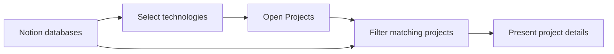

# Tech Match Portfolio

Interactive portfolio designed for technical interviews.

Select the technologies required by a job opportunity and instantly view the projects that match your experience.

## Stack


## Architecture




## Features

### Technologies

- Loads technologies from a Notion database
- Search technologies by name
- Select multiple technologies
- Highlights selected technologies with a marker-style visual effect
- Clears the current selection

### Projects

- Loads projects from a Notion database
- Displays projects in a responsive grid
- Filters projects according to selected technologies
- Highlights the matching technologies in each project
- Opens a modal with description, image, period, company, and full stack

## Notion setup

The application uses two Notion databases.

### Technologies database

| Property | Type |
|---|---|
| Name | Title |
| Category | Select |
| Level | Select |
| Icon Key | Text |
| Years | Number |
| Notes | Text |
| Visible | Checkbox |

### Projects database

| Property | Type |
|---|---|
| Name | Title |
| Company | Select |
| Start Year | Number |
| End Year | Number |
| Cover Image | Files & media |
| Description | Text |
| Technologies | Relation with Technologies |
| Visible | Checkbox |

Both databases must be shared with the Notion integration used by the application.

## Run locally

#### 1. Create your environment file

```bash
cp .env.example .env
```

#### 2. Configure the required values

```env
APP_TITLE=Your Name | Portfolio

NOTION_API_KEY=
NOTION_TECHNOLOGIES_DATA_SOURCE_ID=
NOTION_PROJECTS_DATA_SOURCE_ID=
```

#### 3. Start the application

```bash
docker compose up --build
```

- Application: `http://localhost:3000`

## Project structure

```text
src/
├── app/
│   ├── globals.css
│   ├── layout.tsx
│   └── page.tsx
├── components/
│   └── portfolio-presentation.tsx
├── data/
│   ├── projects.ts
│   └── technologies.ts
└── lib/
    ├── notion.ts
    ├── projects.ts
    └── technologies.ts
```